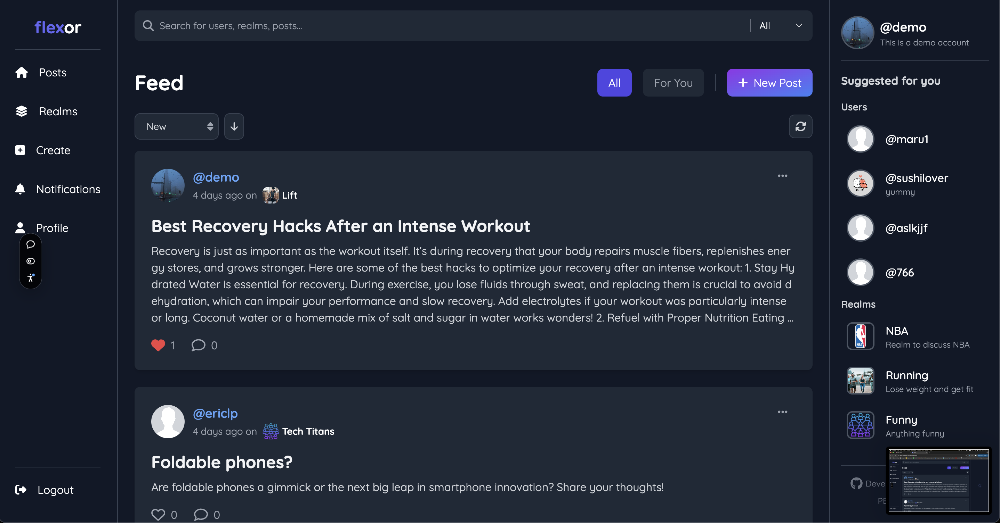
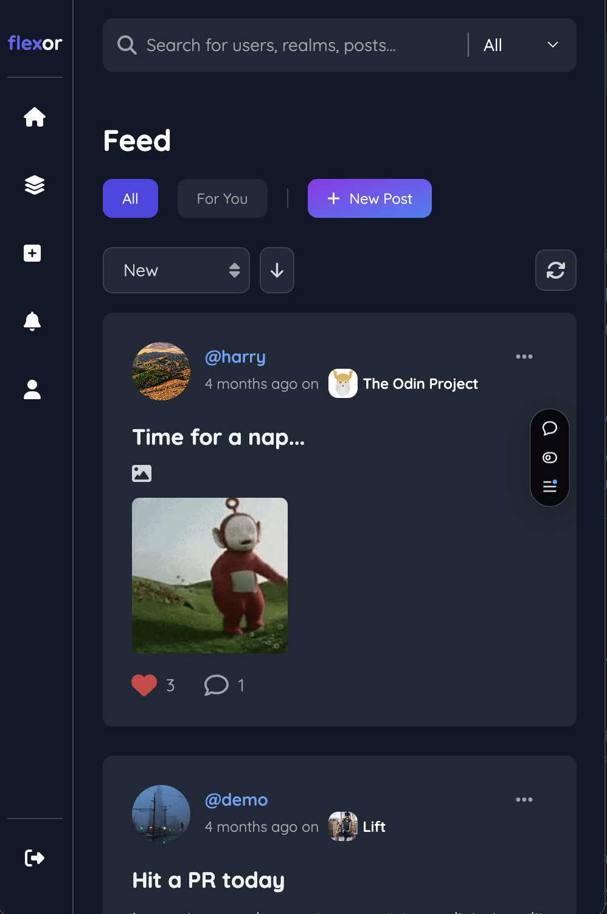

# Flexor-front-end
Frontend build of interactive social media platform using ReactJS.




## Link to Live
https://flexor-front-end-2c6r.vercel.app/feed

## Back End
Source code for the REST API Repo can be found here: https://github.com/HarryAhnHS/flexor-api

## Features
- User authentication and session management.
- Creation, joining, and management of realms.
- Posting content to realms and engaging with other users' posts.
- Interactive and responsive UI.

## Installation

### 1. Clone the Repository

```bash
git clone https://github.com/HarryAhnHS/flexor-front-end.git
cd flexor-front-end
```

### 2. Install Dependencies

Install the required dependencies by running:

```bash
npm install
# or
yarn install
```

### 3. Set Up Environment Variables

Create a `.env` file in the root directory of the project and add the following variables. Adjust the values according to your environment:

```
REACT_APP_API_URL=<backend_server_url>
REACT_APP_OTHER_ENV_VARIABLES=<value>
```

For example:

```
REACT_APP_API_URL=http://localhost:5000
```

### 4. Run the Application Locally

Start the development server:

```bash
npm start
# or
yarn start
```

The application will be available at `http://localhost:3000` by default.

### 5. Build for Production

To create a production build of the application, run:

```bash
npm run build
# or
yarn build
```

The production-ready files will be output to the `build` directory.

## Folder Structure

```
flexor-front-end/
├── public/         # Static assets
├── src/            # Source code
│   ├── components/ # React components
│   ├── pages/      # Page components
│   ├── services/   # API interaction logic
│   ├── styles/     # CSS/SCSS files
│   └── utils/      # Utility functions
├── .env.example    # Example environment variables
├── package.json    # Project metadata and dependencies
└── README.md       # Project documentation
```

## Contributing
If you would like to contribute to this project:

1. Fork the repository.
2. Create a new branch for your feature/bugfix.
3. Commit your changes and open a pull request.
